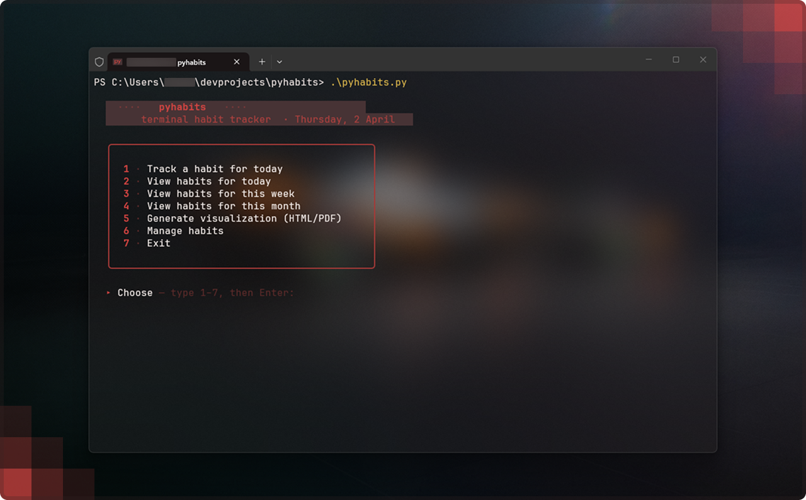
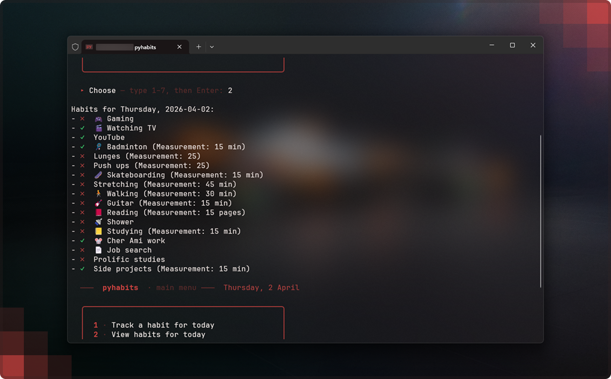

<div align="center">

Light, Python-based terminal app for tracking your habits. <br>
It takes **less than 30 seconds** to log your day.

[](LICENSE)
[](https://www.python.org/downloads/)
[](https://www.figma.com/community/file/1621657997368550374/pyhabits-design)

</div>



## Table of contents

- [What it does](#what-it-does)
- [Features](#features)
- [Screenshots & demo](#screenshots--demo)
- [Requirements](#requirements)
- [Installation](#installation)
- [Usage](#usage)
- [Data & file layout](#data--file-layout)
- [Privacy & GitHub](#privacy--github)
- [Credits & tooling](#credits--tooling)
- [License](#license)

## What it does

**pyhabits** stores your habits in a local JSON file, runs entirely in the terminal, and lets you track your habits quickly: pick a habit (by number or name), mark today done, and move on. Optional exports give you spreadsheets, Markdown, or **print-ready HTML/PDF** year calendars.

## Features

| Area | What you get |
|------|----------------|
| **Tracking** | Mark habits **completed for today**; habits grouped by **category** with optional **emoji icons**; pick by **number** or type the name. |
| **Smart naming** | **Case-insensitive** match and **fuzzy suggestions** (typos) before accidentally creating a duplicate habit. |
| **New habits** | Prompted **measurement** (e.g. “30 min”), **category**, and optional **icon** when you add a name that doesn’t exist yet. |
| **Archive / retire** | **Archive** a habit to hide it from daily lists while **keeping all historical completions** (e.g. a finished project). **Unarchive** anytime. |
| **Manage** | **Edit category/icon** for any habit; **list archived** habits. |
| **Views** | **Today**: checklist for active habits. **Week**: **day-first** layout (each weekday lists habits you completed). **Month**: day-by-day checklist of active habits. |
| **Exports** | After **week** or **month** view, optional export to **JSON**, **CSV**, or **Markdown** (week Markdown matches the day-first layout). |
| **Visualizations** | **HTML + PDF** yearly calendar grids (light, print-oriented styling). **All habits** → **one combined** document; or **one habit** only. You choose the **report year** (not only the current year). |

## Screenshots

Tracking daily habits.



## Requirements
- **Python** - 3.8 or newer recommended.
- **pdfkit**
- **wkhtmltopdf** - Separate install, must be on your `PATH`. Without it, HTML still works; PDF will fail until wkhtmltopdf is installed.


## Installation

### 1. Clone the repository

```bash
git clone https://github.com/annaozola/pyhabits
cd pyhabits
```

### 2. Python dependencies

```bash
pip install pdfkit
```

If you use the bundled `requirements.txt`, install with:

```bash
pip install -r requirements.txt
```

> `webbrowser` is part of the Python standard library — it should **not** be installed from PyPI. If `pip install -r requirements.txt` errors on `webbrowser`, remove that line from `requirements.txt` and run the command again.

### 4. Install wkhtmltopdf (for PDF)

- **Windows:** run the installer from [wkhtmltopdf.org](https://wkhtmltopdf.org/downloads.html) and ensure the install directory is on your **PATH**.
- **macOS:** e.g. `brew install wkhtmltopdf` (Homebrew).
- **Linux:** use your distro package manager or the official package from the same site.

### 5. Run

```bash
python pyhabits.py
```

## Data & file layout

```
pyhabits/
├── pyhabits.py          # application entry point
├── requirements.txt     
├── LICENSE
├── README.md
├── assets/              # Optional assets
├── user/                # YOUR DATA — created at runtime
│   └── habits.json      
└── exports/             # Optional exports & visualizations
    └── YYYY/
        └── DD-MM-YYYY/
            └── … html / pdf …
```

### `habits.json` shape (per habit)

Each habit is keyed by its **name**; values include:

- `measurement` — optional string (e.g. “20 pages”).
- `completion` — map of `YYYY-MM-DD` → completion flag.
- `category` — string (default `General`).
- `icon` — optional string (emoji or character).
- `archived` — boolean; archived habits are hidden from tracking/lists but kept for history and exports you choose.

You can **back up** `user/habits.json` or use **JSON export** from the app for an extra copy.

## Privacy & GitHub

- `user/` and `exports/` are listed in **`.gitignore`** so habit data and generated files are **not** committed by default.
- Before every push: `git status` — confirm you are not force-adding `user/` or `exports/`.
- Everyone who clones the repo gets **their own** local `user/` folder when they run the app.

## Disclaimer

pyhabits was created using AI coding assistants, reviewed by a human.
