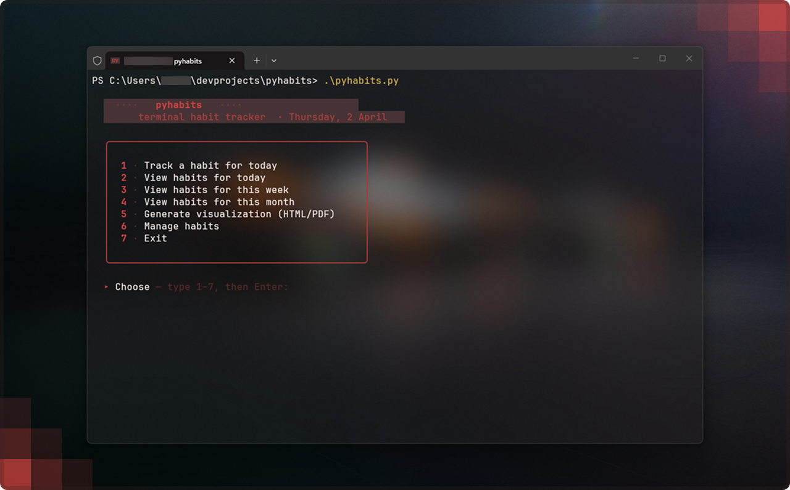
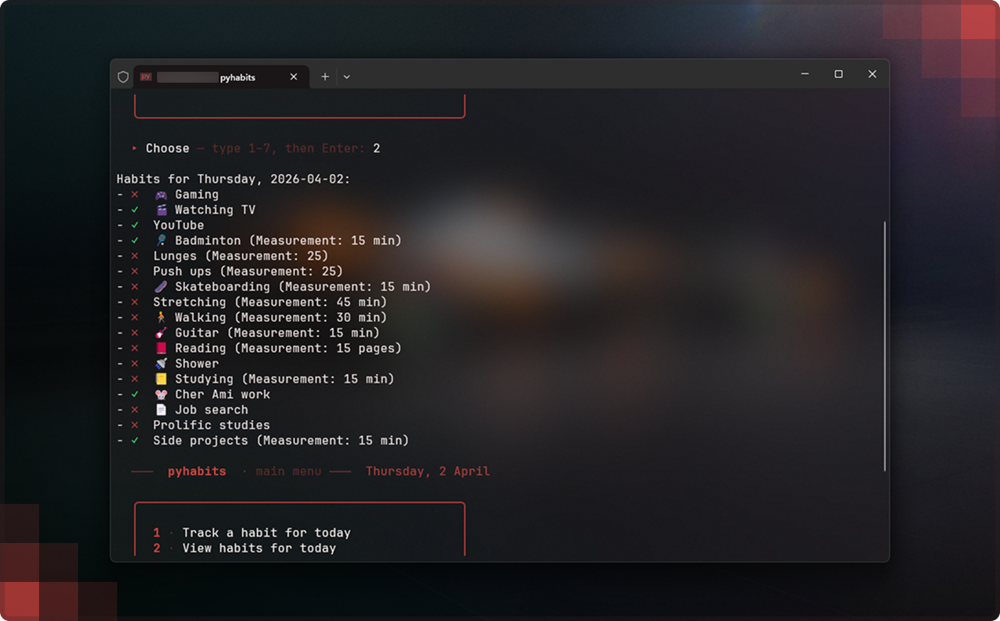

<div align="center">

Light, Python-based terminal app for tracking your habits. <br>
It takes **less than 30 seconds** to log your day.

[](LICENSE)
[](https://www.python.org/downloads/)
[](https://www.figma.com/community/file/1621657997368550374/pyhabits-design)

</div>



## Table of Contents

- [What it does](#what-it-does)
- [Features](#features)
- [Screenshots](#screenshots)
- [Requirements](#requirements)
- [Installation](#installation)
- [Setting up cloud sync](#setting--up--cloud--sync)
- [Data & file layout](#data--file-layout)
- [Privacy & GitHub](#privacy--github)
- [Credits & tooling](#credits--tooling)
- [License](#license)

## What It Does

**pyhabits** stores your habits in a local JSON file, runs entirely in the terminal, and lets you track your habits quickly: pick a habit (by number or name), mark today done, and move on. Optional exports give you spreadsheets, Markdown, or **print-ready HTML/PDF** year calendars.

## Features

| Area | What you get |
|------|----------------|
| **Tracking** | Mark habits **completed for today**; habits grouped by **category** with optional **emoji icons**; pick by **number** or type the name. |
| **Smart naming** | **Case-insensitive** match and **fuzzy suggestions** (typos) before accidentally creating a duplicate habit. |
| **New habits** | Prompted **measurement** (e.g. “30 min”), **category**, and optional **icon** when you add a name that doesn’t exist yet. |
| **Archive / retire** | **Archive** a habit to hide it from daily lists while **keeping all historical completions** (e.g. a finished project). **Unarchive** anytime. |
| **Manage** | **Edit category/icon** for any habit; **list archived** habits. |
| **Views** | **Today**: checklist of all active habits with completion status. **Week**: each weekday shows all habits and whether you completed them. **Month**: day-by-day checklist of all active habits. |
| **Statistics** | Per-habit **current streak**, **longest streak**, **completion rate**, and **total completions** — shown in a table sorted by category. Habits with icons display them inline. |
| **Exports** | After **week** or **month** view, optional export to **JSON**, **CSV**, or **Markdown** (week Markdown matches the day-first layout). |
| **Visualizations** | **HTML + PDF** yearly calendar grids (light, print-oriented styling). **All habits** → **one combined** document; or **one habit** only. You choose the **report year** (not only the current year). |

## Screenshots

Tracking daily habits.



## Requirements
- **Python 3.8+**
- **pyfiglet** — terminal logo rendering (installed via `requirements.txt`)
- **WeasyPrint** — PDF export (installed via `requirements.txt`). On Windows, also requires the [GTK runtime](https://doc.courtbouillon.org/weasyprint/stable/first_steps.html). Without it, HTML reports still work; only PDF export will fail.
- **pdfkit + wkhtmltopdf** — optional legacy fallback if WeasyPrint cannot be installed.


## Installation

#### 1. Clone the repository

```bash
git clone https://github.com/annaozola/pyhabits
cd pyhabits
```

#### 2. Python dependencies

```bash
pip install -r requirements.txt
```

#### 3. Install the GTK runtime (Windows only, for PDF export)

WeasyPrint requires the GTK runtime on Windows. Follow the instructions at [doc.courtbouillon.org](https://doc.courtbouillon.org/weasyprint/stable/first_steps.html). Without it, HTML visualizations still work — only PDF export is affected.

#### 4. Run

```bash
python pyhabits.py
```
## Setting Up Cloud Sync
By default, **pyhabits** stores your data locally on your machine. If you want to sync your habits across multiple devices, you have two, easy options to do so:

**Option 1:** Sync the ```user``` folder with a cloud storage provider such as OneDrive, Google Drive, Dropbox, MEGA, or Nextcloud.

**Option 2:** Sync with your own Firebase project.

### How to Setup Cloud Sync with Firebase
The following steps assume that you have already cloned the repository and installed the required packages.

The steps may change after a certain time has passed and Firebase has been updated.

#### 1. Create a Firebase project
1.1. Go to [Firebase Console](https://console.firebase.google.com/) and click **Add Project**.

1.2. Give it a name (e.g., ```my-pyhabits-sync```) and create the project.

#### 2. Enable authentication
2.1. On the left sidebar, navigate to **Build > Authentication** and click **Get Started**.

2.2. Navigate to the **Sign-in method** tab.

2.3. Enable **Email/Password**.

2.4. Enable **Google** (this allows the browser-based Google sign-in to work).

#### 3. Enable the database
3.1. On the left sidebar, navigate to **Build > Firestore Database** and click **Create Database**.

3.2. Choose a location and start in **Production Mode**.

3.3. Navigate to the **Rules** tab and paste this exact code to ensure *only you* can access your data:

```javascript
rules_version = '2';
service cloud.firestore {
  match /databases/{database}/documents {
    match /users/{userId}/habits/{document=**} {
      allow read, write: if request.auth != null && request.auth.uid == userId;
    }
  }
}
```
3.4. Click **Publish**.

#### 4. Connect the terminal app
4.1. In your Firebase Console, click the **Gear Icon** (Project Settings) at the top left.

4.2. In the ```pyhabits``` folder on your computer, rename the ```.env.example``` file to ```.env```

4.3. Open the ```.env``` file and paste in your Project ID and Web API Key (found in your Firebase Project Settings):

```env
FIREBASE_API_KEY=your_web_api_key_here
FIREBASE_PROJECT_ID=your_project_id_here
```
#### 5. Start syncing
Run the terminal app and press ```8``` to start syncing with your Firebase project.

## Data & File Layout

```
pyhabits/
├── pyhabits.py          # application entry point
├── requirements.txt     
├── LICENSE
├── README.md
├── assets/              # Optional assets
├── user/                # YOUR DATA — created at runtime
│   └── habits.json      
└── exports/             # Optional exports & visualizations
    └── YYYY/
        └── DD-MM-YYYY/
            └── … html / pdf …
```

### `habits.json` shape (per habit)

Each habit is keyed by its **name**; values include:

- `measurement` — optional string (e.g. “20 pages”).
- `completion` — map of `YYYY-MM-DD` → completion flag.
- `category` — string (default `General`).
- `icon` — optional string (emoji or character).
- `archived` — boolean; archived habits are hidden from tracking/lists but kept for history and exports you choose.

You can **back up** `user/habits.json` or use **JSON export** from the app for an extra copy.

## Privacy & GitHub

- `user/` and `exports/` are listed in **`.gitignore`** so habit data and generated files are **not** committed by default.
- Before every push: `git status` — confirm you are not force-adding `user/` or `exports/`.
- Everyone who clones the repo gets **their own** local `user/` folder when they run the app.

## Disclaimer

pyhabits was created using AI coding assistants, reviewed by a human.
